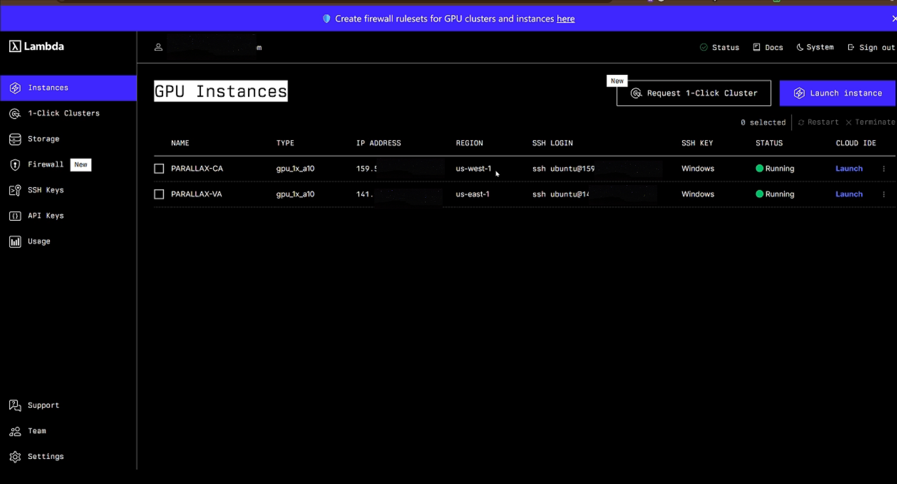
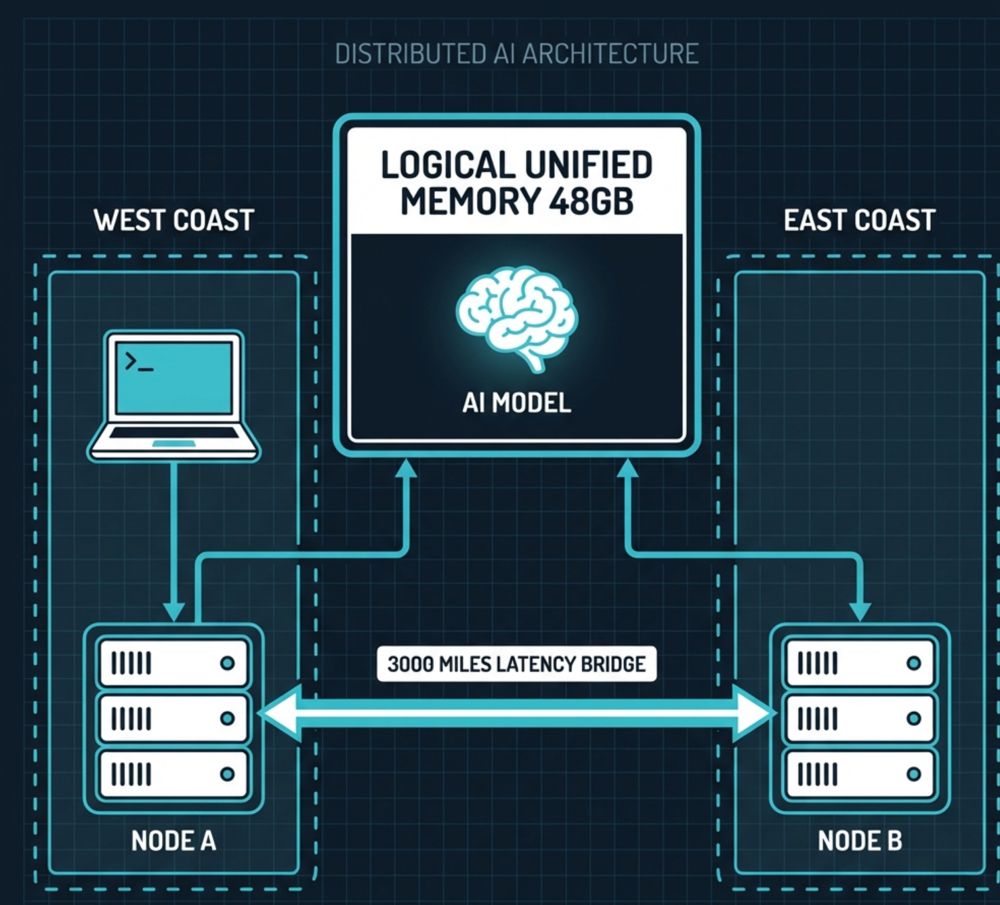
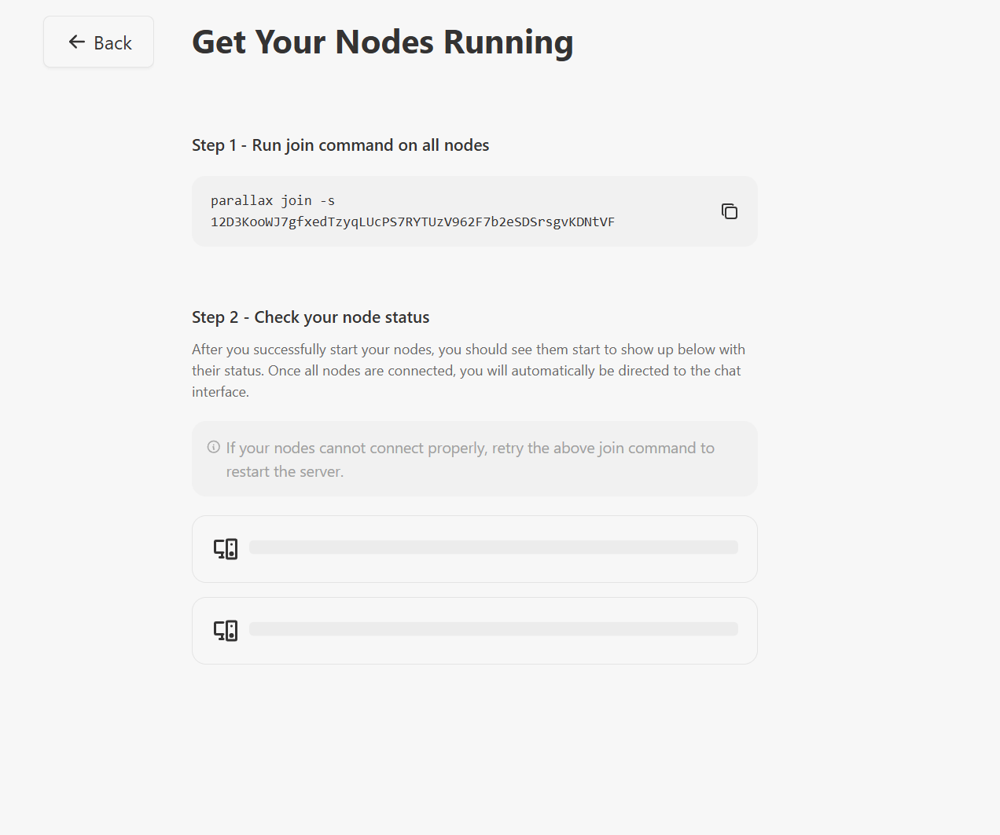
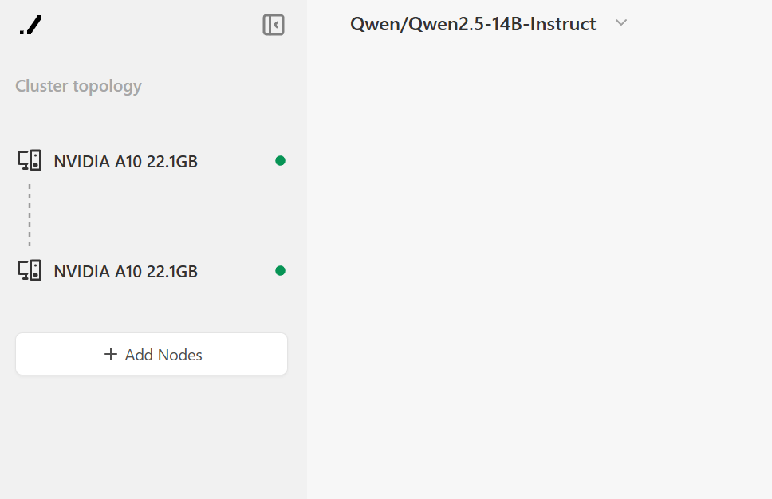
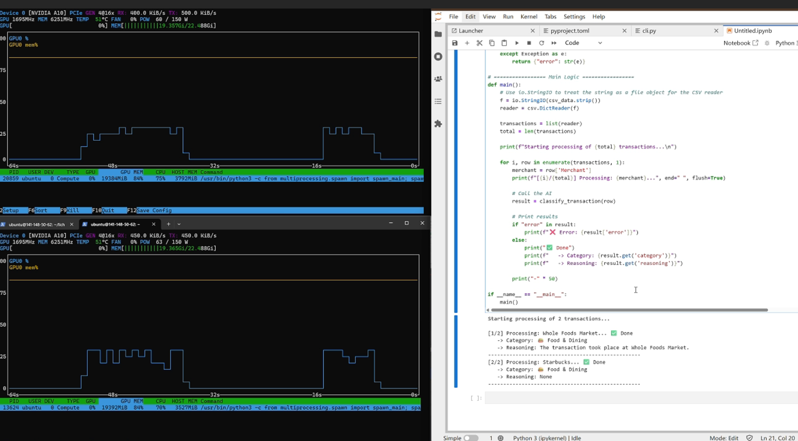

# Coast-to-Coast Cluster: Breaking VRAM Limits with Parallax

> **3,000 miles apart. 48GB Unified VRAM. One massive private AI.**

This project is `🏆 Submission for GradientHQ "Build Your Own AI Lab"`

---

## 🚨 The Challenge: The 24GB Wall

I wanted to run **Qwen 2.5 14B-Instruct** in **Full Precision (FP16)** to ensure maximum accuracy for a financial analysis agent.

| Requirement | Value |
|:--|:--|
| **Model VRAM Needed** | ~41 GB (Load + Context) |
| **Available Hardware** | NVIDIA A10 (24 GB VRAM) |
| **Single GPU Result** | ❌ **Instant OOM (Out of Memory)** |

**The question:** Can we stitch together two GPUs separated by 3,000 miles to run a model that physically doesn't fit on either?

---

## 💡 The Solution: Coast-to-Coast Distributed Inference

Using **Parallax**, I built a truly decentralized setup spanning **3 time zones** — stitching together two remote GPU instances located on opposite sides of the United States.

| Node | Location | Hardware | Role |
|:--|:--|:--|:--|
| **Node A** | California (US-West) | NVIDIA A10 (24GB) | Master / Tensor Shard 0 |
| **Node B** | Virginia (US-East) | NVIDIA A10 (24GB) | Worker / Tensor Shard 1 |
| **Cluster** | **~3,000 miles apart** | **48GB Unified VRAM** | **✅ RUNNING** |

**Network:** Public Internet (No high-speed interconnects) — just raw WAN latency (~70ms).


*Two A10 instances running: PARALLAX-CA (us-west-1) and PARALLAX-VA (us-east-1)*

---

## 🏗️ Architecture



The system serves a **Privacy-First Finance Agent**:
1. Ingests raw CSV credit card statements
2. Uses the distributed LLM to categorize transactions (e.g., "Whole Foods" → "Groceries")
3. Visualizes spending data in a local dashboard
4. **All data stays on controlled infrastructure — no public APIs, no data leaks**

---

## 🛠️ Setup & Replication

### 1. Provision GPU Instances

Spin up two A10 instances in different regions. I used Lambda Labs:
- **PARALLAX-CA**: `us-west-1` (California)
- **PARALLAX-VA**: `us-east-1` (Virginia)

### 2. Start Parallax on Master Node (CA)

```bash
parallax run --host 0.0.0.0
```

This generates a join token for worker nodes:



### 3. Join Worker Node (VA)

On the Virginia instance, run the join command with the token:

```bash
parallax join -s 12D3KooWJ7gfxedTzyqLUcPS7RYTUzV962F7b2eSDSrsgvKDNtVF
```

### 4. Verify Cluster Status

Once connected, both nodes appear in the cluster topology:


*Cluster topology showing 2x NVIDIA A10 22.1GB with Qwen/Qwen2.5-14B-Instruct loaded*

### 5. Model Loading

Parallax automatically distributes the model weights across both GPUs:


*Terminal showing Qwen2.5-14B-Instruct loading with distributed weight files across layers [0, 24]*

---

## 📈 Performance & Proof

### Real-Time GPU Monitoring


*nvtop showing both A10 GPUs actively processing — ~19GB VRAM usage on each node, proving true model parallelism*

Key observations:
- **Top panel:** CA node (Device 0) — 19.3GB/22.4GB VRAM, 31% GPU utilization
- **Bottom panel:** VA node (Device 0) — 19.3GB/22.4GB VRAM, 28% GPU utilization
- **Both GPUs spike in sync** during inference, demonstrating coordinated tensor computation

### Live Inference Demo


*Left: Terminal logs showing data forwarding between nodes | Center: Parallax UI | Right: Model generating code in real-time*

---

## 💰 The Application: Privacy-First Finance Agent

The real-world use case: **Automatically categorize credit card transactions without sending sensitive financial data to external APIs.**

### How It Works

The Finance Agent reads raw CSV credit card statements and uses the distributed LLM to intelligently classify each transaction into one of 13 spending categories:

| Category | Example Merchants |
|:--|:--|
| 🏠 Housing & Home | Rent, Mortgage, Home Depot |
| 💡 Utilities | Electric, Water, Internet |
| 🍔 Food & Dining | Whole Foods, Starbucks, DoorDash |
| 🚗 Transportation | Gas, Uber, Car Insurance |
| ❤️ Health & Wellness | Pharmacy, Gym, Doctor |
| 🛍️ Personal Spending | Amazon, Target, Clothing |
| 🎬 Entertainment | Netflix, Spotify, Movies |
| ✈️ Travel | Airlines, Hotels, Airbnb |
| 👶 Children & Dependents | Daycare, School, Kids Activities |
| 🐶 Pets | Vet, Pet Food, Grooming |
| 🎁 Gifts & Donations | Charity, Gift Cards |
| 💸 Financial & Debt | Loan Payments, Credit Card Fees |
| 📦 Miscellaneous | Everything else |

### Live Demo: Transaction Classification


*Left: Both GPUs processing in parallel (nvtop) | Right: Python script classifying transactions via the Parallax endpoint*

**Sample Output:**
```
Starting processing of 2 transactions...

[1/2] Processing: Whole Foods Market... ✅ Done
   -> Category: 🍔 Food & Dining
   -> Reasoning: The transaction took place at Whole Foods Market.
--------------------------------------------------
[2/2] Processing: Starbucks... ✅ Done
   -> Category: 🍔 Food & Dining
   -> Reasoning: None
--------------------------------------------------
```

### The Code

The agent sends each transaction to the local Parallax endpoint (`localhost:3000`) which routes it through the distributed cluster:

```python
# Configuration - pointing to local Parallax main server. This will route to run the jon in main and worker nodes.
URL = "http://localhost:3001/v1/chat/completions"

def classify_transaction(row_dict):
    transaction_desc = (
        f"Date: {row_dict['Date']}, "
        f"Merchant: {row_dict['Merchant']}, "
        f"Description: {row_dict['Description']}, "
        f"Amount: ${row_dict['Amount']}"
    )

    payload = {
        "model": MODEL_NAME,
        "max_tokens": 512,
        "temperature": 0.0,  # Deterministic results
        "response_format": { "type": "json_object" },
        "messages": [
            {"role": "system", "content": CATEGORIES_PROMPT},
            {"role": "user", "content": f"Classify this transaction:\n{transaction_desc}"}
        ]
    }

    response = requests.post(URL, headers=HEADERS, json=payload)
    return json.loads(response.json()['choices'][0]['message']['content'])
```

### Why Self-Hosted Matters for Finance

| Approach | Privacy | Cost | Control |
|:--|:--|:--|:--|
| OpenAI/Claude API | ❌ Data sent to third party | 💸 Per-token pricing | ❌ Limited |
| **Self-Hosted Parallax** | ✅ **Data never leaves your infra** | 💰 **Fixed GPU cost** | ✅ **Full control** |

Your credit card statements contain sensitive PII (names, amounts, merchants, spending patterns). With Parallax, **all inference happens on your controlled infrastructure** — no data leaks, no third-party logging, no compliance nightmares.

---

## 🔑 Key Takeaways

| Challenge | Solution |
|:--|:--|
| 41GB model on 24GB GPU | ✅ Distributed tensor splitting across 2 nodes |
| ~70ms WAN latency | ✅ Parallax pipelines requests efficiently |
| Data privacy concerns | ✅ Self-hosted infrastructure, no external APIs |
| Complex cluster setup | ✅ Simple `parallax run` / `parallax join` workflow |

---

## 🎯 Why This Matters

1. **Democratizing Large Models:** You don't need a $10,000 GPU to run 14B+ parameter models
2. **Geographic Flexibility:** Compute can be anywhere — your basement, a friend's PC, or cloud instances across continents
3. **Privacy-First AI:** Sensitive data (like financial records) never leaves your controlled infrastructure
4. **True Decentralization:** This isn't just multi-GPU — it's multi-datacenter, multi-region AI

---

## 📁 Project Structure

```
gradient-pf/
├── README.md
├── finance_agent_local.ipynb    # Privacy-first finance agent notebook
└── images/
    ├── architecture.png         # System architecture diagram
    ├── image.png                # Lambda instances dashboard
    ├── joinnode.png             # Parallax join setup
    ├── bothup.png               # Cluster topology view
    ├── running.png              # Model loading terminal
    └── fa_local.png             # Finance agent demo screenshot
```

---

## 🔗 Links

- **Parallax:** [Gradient HQ](https://gradient.ai)
- **Model:** [Qwen/Qwen2.5-14B-Instruct](https://huggingface.co/Qwen/Qwen2.5-14B-Instruct)
- **Infrastructure:** [Lambda Labs](https://lambdalabs.com)

---

**Built for the GradientHQ "Build Your Own AI Lab" Competition**

*Proving that latency is not the enemy — it's just another engineering problem to solve.*
